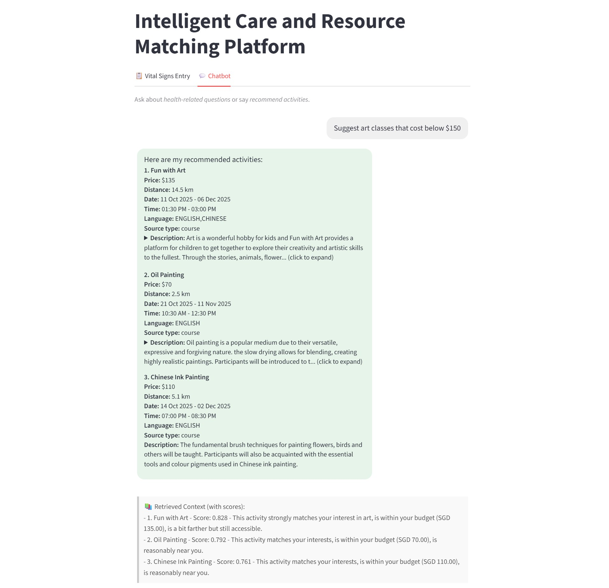

## SECTION 1 : PROJECT TITLE
## Intelligent Care and Resource Matching Platform



---

## SECTION 2 : EXECUTIVE SUMMARY / PAPER ABSTRACT
Singapore's rapidly ageing population presents critical challenges in eldercare, with one-third of elderly individuals living alone as of 2024, heightening the risks of social isolation and dependence on external support. The traditional care model will face increasing pressures as the nation continues to age further with the proportion of working adults to elderly set to decrease even further. To help seniors live independently and safely, there is a need for an accessible solution that addresses both health and social wellbeing.

Our proposed Intelligent Care and Resource Matching Platform is designed to meet these needs through three main functions:
- Monitor vital signs through wearable devices and raises alerts for caregivers or social workers when irregular reading is detected
- Personalised activity recommendations that take into account each user's interests, preferences, and home location
- An intuitive chatbot that enables users to make enquiries on health-related questions or explore activity options using everyday language

The platform delivers significant value to Singapore’s ageing community by improving both independence and quality of life for seniors. Seniors using the platform can live with the assurance that their health is being watched over and that any warning signs will trigger timely alerts. This sense of reliability supports both independence and emotional comfort. Together with tailored activity recommendations, it helps maintain both social connection and mental wellbeing. As participation grows, the burden on caregivers and community resources will also naturally become lighter.

---

## SECTION 3 : CREDITS / PROJECT CONTRIBUTION

| Official Full Name  | Student ID (MTech Applicable)  | Work Items (Who Did What) | Email (Optional) |
| :------------ |:---------------:| :-----| :-----|
| Ashira  Wee   | A0243826B | Health monitoring rule engine, Testing, Research, Reports(Main Contributor) | e0838394@u.nus.edu |
| Lin Mingjie   | A0330090W | Architecture design construction and performance testing of the recommendation system, Testing, Research, Reports | e1554417@u.nus.edu |
| Yan Binghao   | A0291825X | Frontend and backend dev for chatbot in speech recognition convert to text, RAG document collection, Testing, Research, Reports| e1335037@u.nus.edu |
| Zhao Hongming | A0150137R | Project coordination, Project containerisation, Frontend and backend dev for Chatbot and RAG, Data collection, Testing, Research, Reports| e0015119@u.nus.edu |
| Zhao Yisen    | A0328788E | Data collection & cleaning, Recommendation system improvement, Map visualization, Testing, Research, Reports| e1553115@u.nus.edu |

---

## SECTION 4 : VIDEO OF SYSTEM MODELLING & USE CASE DEMO

### Use Case Demo 
[](https://youtu.be/vfXN81DZRko)

### System Design
[](https://youtu.be/hRSPrcxE1Uo)

---

## SECTION 5 : USER GUIDE

`Refer to appendix <Installation & User Guide> in project report at Github Folder: ProjectReport`

**1. Clone the repository**
```shell
git clone https://github.com/hongming-github/IRS-PM-2025-08-18-AIS07FT-LionLogic-Intelligent_Care_and_Resource_Matching_Platform.git

cd IS Project
```

**2.  Create an .env File in the project root and configure API keys / tokens**
```
#Doubao API
OPENAI_API_KEY=<your-api-key>
OPENAI_API_BASE=https://ark.cn-beijing.volces.com/api/v3

#Pinecone API Key
PINECONE_API_KEY=<your-api-key>
PINECONE_ENVIRONMENT=<your-env>

#Telegram Bot Token
TELEGRAM_BOT_TOKEN=<your-telegram-bot-token>
CHAT_ID=<your-chat-id>

#Baidu API Key
BAIDU_API_KEY=<your-api-key>
BAIDU_SECRET_KEY=<your-secret-key>
```

**3. Build and start services**
```shell
docker compose up --build
```

**4. Train intent classifier – run once during setup**
Running the command below will generate the file ```
backend/chatbot/intent_clf.pkl```

```shell
docker compose run --rm fastapi python backend/chatbot/train_intent.py
```

**5. Build the RAG index –run once during setup**
```shell
docker compose run --rm fastapi python backend/chatbot/build_index.py
```

**6. Restart services after training**
```shell
docker compose up
```

**7. Access Application**
Access the application through your browser at http://localhost:8501

---
## SECTION 6 : PROJECT REPORT / PAPER

`Refer to project report at Github Folder: ProjectReport`

**Recommended Sections for Project Report / Paper:**
- Business Case
	- Executive Summary
	- Product Description
	- Strategy
	- Market Analysis
	- Financial Analysis
	- Plans
- System Design
	- Scope
	- Architecture Overview
	- Component-Level Design
	- Data Design
- System Development
	- Implementation Process
	- Tools and Technologies
- Findings
- References
- Appendix A - Output from Activity Recommendation Model
- Appendix B - Output from RAG
- Appendix C - Output from Rule-based Engine
- Appendix D - Project Proposal
- Appendix E - Mapped System Functionality to Course Knowledge
- Appendix F - Installation & User Guide

---

**This practice module is part of the [Graduate Certificate in Intelligent Reasoning Systems (IRS)](https://www.iss.nus.edu.sg/stackable-certificate-programmes/graduate-certificate/artificial-intelligence/graduate-certificate-in-intelligent-reasoning-systems) offered by [NUS-ISS](https://www.iss.nus.edu.sg/)**

